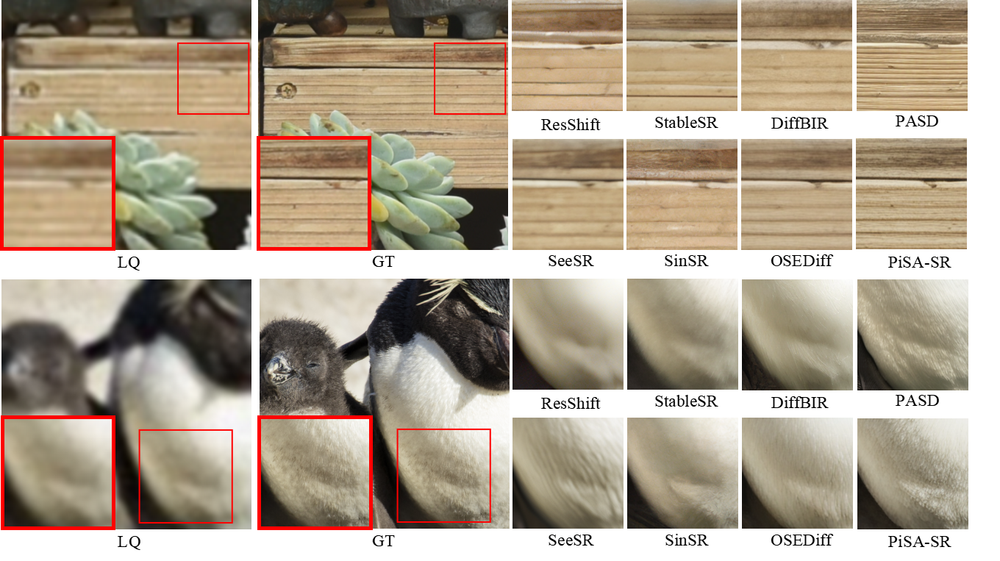

## Pixel-level and Semantic-level Adjustable Super-resolution: A Dual-LoRA Approach

[Lingchen Sun](https://scholar.google.com/citations?hl=zh-CN&tzom=-480&user=ZCDjTn8AAAAJ)1,2
| [Rongyuan Wu](https://scholar.google.com/citations?user=A-U8zE8AAAAJ&hl=zh-CN)1,2 | 
[Zhiyuan Ma](https://scholar.google.com/citations?user=F15mLDYAAAAJ&hl=en)1 | 
[Shuaizheng Liu](https://scholar.google.com/citations?user=wzdCc-QAAAAJ&hl=en)1,2 | 
[Qiaosi Yi](https://dblp.org/pid/249/8335.html)1,2 |
[Lei Zhang](https://www4.comp.polyu.edu.hk/~cslzhang)1,2

1The Hong Kong Polytechnic University, 2OPPO Research Institute

**ABSTRACT** 
Diffusion prior-based methods have shown impressive results in real-world image super-resolution (SR). However, most existing methods entangle pixel-level and semanticlevel SR objectives in the training process, struggling to balance pixel-wise fidelity and perceptual quality. Meanwhile, users have varying preferences on SR results, thus it is demanded to develop an adjustable SR model that can be tailored to different fidelity-perception preferences during inference without re-training. We present Pixel-level and Semantic-level Adjustable SR (PiSA-SR), which learns two LoRA modules upon the pre-trained stable-diffusion (SD) model to achieve improved and adjustable SR results. We first formulate the SD-based SR problem as learning the residual between the low-quality input and the high-quality output, then show that the learning objective can be decoupled into two distinct LoRA weight spaces: one is characterized by the ℓ2-loss for pixel-level regression, and another is characterized by the LPIPS and classifier score distillation losses to extract semantic information from pretrained classification and SD models. In its default setting, PiSA-SR can be performed in a single diffusion step, achieving leading real-world SR results in both quality and efficiency. By introducing two adjustable guidance scales on the two LoRA modules to control the strengths of pixel-wise fidelity and semantic-level details during inference, PiSASR can offer flexible SR results according to user preference without re-training.
---

## ⏰ Update
The code and model will be ready soon.
- **2024.12.4**: This repo and paper are released.

:star: If PiSA-SR is helpful to your images or projects, please help star this repo. Thanks! :hugs:

## 🌟 Overview Framework

(a) Training procedure of PiSA-SR. During the training process, two LoRA modules are respectively optimized for pixel-level and semantic-level enhancement.

(b) Inference procedure of PiSA-SR. During the inference stage, users can use the default setting to reconstruct the high-quality image in one-step diffusion or adjust λpix and λsem to control the strengths of pixel-level and semantic-level enhancement.
## 😍 Visual Results
### Adjustable SR

By increasing the guidance scale λpix on the pixel-level LoRA module, the image degradations such as noise and compression artifacts can be gradually removed; however, a too-strong λpix will make the SR image over-smoothed. By increasing the guidance scale λsem on the semantic-level LoRA module, the SR images will have more semantic details; nonetheless, a too-high λsem will generate visual artifacts.

### Comparisons with Other DM-Based SR Methods
