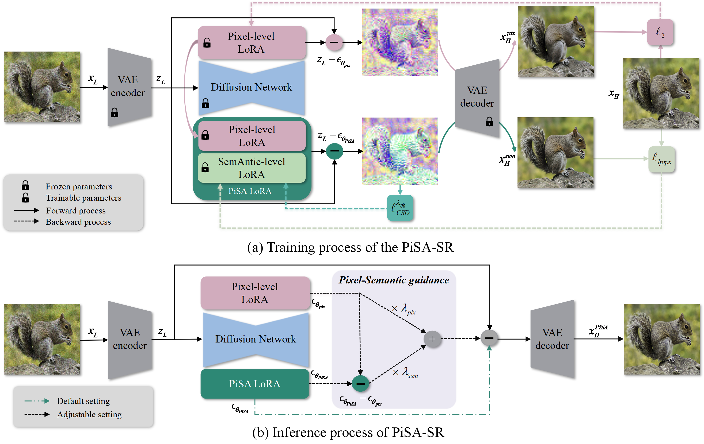

<div align="center">
<h2>Pixel-level and Semantic-level Adjustable Super-resolution: A Dual-LoRA Approach</h2>

🚩 Accepted by CVPR2025

<a href='https://arxiv.org/pdf/2412.03017'></a>


[Lingchen Sun](https://scholar.google.com/citations?hl=zh-CN&tzom=-480&user=ZCDjTn8AAAAJ)<sup>1,2</sup>
| [Rongyuan Wu](https://scholar.google.com/citations?user=A-U8zE8AAAAJ&hl=zh-CN)<sup>1,2</sup> | 
[Zhiyuan Ma](https://scholar.google.com/citations?user=F15mLDYAAAAJ&hl=en)<sup>1</sup> | 
[Shuaizheng Liu](https://scholar.google.com/citations?user=wzdCc-QAAAAJ&hl=en)<sup>1,2</sup> | 
[Qiaosi Yi](https://dblp.org/pid/249/8335.html)<sup>1,2</sup> |
[Lei Zhang](https://www4.comp.polyu.edu.hk/~cslzhang)<sup>1,2</sup>

<sup>1</sup>The Hong Kong Polytechnic University, <sup>2</sup>OPPO Research Institute
</div>


## ⏰ Update
- **2025.3.25**: Training code is released.
- **2025.1.2**: Code and models are released.
- **2024.12.4**: The paper and this repo are released.

:star: If PiSA-SR is helpful to your images or projects, please help star this repo. Thanks! :hugs:

## 🌟 Overview Framework




(a) Training procedure of PiSA-SR. During the training process, two LoRA modules are respectively optimized for pixel-level and semantic-level enhancement.

(b) Inference procedure of PiSA-SR. During the inference stage, users can use the default setting to reconstruct the high-quality image in one-step diffusion or adjust λ<sub>pix</sub> and λ<sub>sem</sub> to control the strengths of pixel-level and semantic-level enhancement.
## 😍 Visual Results
### Demo on Real-world SR
[](https://imgsli.com/MzM0NDE3) [](https://imgsli.com/MzM0NDIz) [](https://imgsli.com/MzM0NDIx) [](https://imgsli.com/MzM0NDI2) 

### Demo on AIGC Enhancement
[](https://imgsli.com/MzM0NDI4) [](https://imgsli.com/MzM0NDMx) [](https://imgsli.com/MzM0NDM1) [](https://imgsli.com/MzM0NDM0) [](https://imgsli.com/MzM0NDM2)

### Adjustable SR Results


By increasing the guidance scale λ<sub>pix</sub> on the pixel-level LoRA module, the image degradations such as noise and compression artifacts can be gradually removed; however, a too-strong λ<sub>pix</sub> will make the SR image over-smoothed. By increasing the guidance scale λ<sub>sem</sub> on the semantic-level LoRA module, the SR images will have more semantic details; nonetheless, a too-high λ<sub>sem</sub> will generate visual artifacts.

### Comparisons with Other DM-Based SR Methods


## ⚙ Dependencies and Installation
```shell
## git clone this repository
git clone https://github.com/csslc/PiSA-SR
cd PiSA-SR


# create an environment
conda create -n PiSA-SR python=3.10
conda activate PiSA-SR
pip install --upgrade pip
pip install -r requirements.txt
```

## 🍭 Quick Inference
#### Step 1: Download the pretrained models
- Download the pretrained SD-2.1-base models from [HuggingFace](https://huggingface.co/stabilityai/stable-diffusion-2-1-base).
- Download the RAM model from [HuggingFace](https://huggingface.co/spaces/xinyu1205/recognize-anything/blob/main/ram_swin_large_14m.pth) and save the model to the [folder](src/ram_pretrain_model).
- Download the PiSA-SR model from [`GoogleDrive`](https://drive.google.com/drive/folders/1oLetijWNd59xwJE5oU-eXylQBifxWdss?usp=drive_link) or [`BaiduNetdisk(pwd: pisa)`](https://pan.baidu.com/s/1wcMVp9vmsDrLnK0yTAH2Ig) and put the models in the `preset/models`:

#### Step 2: Prepare testing data
You can put the testing images in the `preset/test_datasets`.

#### Step 3: Running testing command 
For default setting:
```
python test_pisasr.py \
--pretrained_model_path preset/models/stable-diffusion-2-1-base \
--pretrained_path preset/models/pisa_sr.pkl \
--process_size 512 \
--upscale 4 \
--input_image preset/test_datasets \
--output_dir experiments/test \
--default
```

For adjustable setting:
```
python test_pisasr.py \
--pretrained_model_path preset/models/stable-diffusion-2-1-base \
--pretrained_path preset/models/pisa_sr.pkl \
--process_size 512 \
--upscale 4 \
--input_image preset/test_datasets \
--output_dir experiments/test \
--lambda_pix 1.0 \
--lambda_sem 1.0
```
🛠️You can adjust `lambda_pix` and `lambda_sem` to **control the strengths of pixel-wise fidelity and semantic-level details**.

We integrate [tile_diffusion](https://github.com/albarji/mixture-of-diffusers) and [tile_vae](https://github.com/pkuliyi2015/multidiffusion-upscaler-for-automatic1111/tree/main) to the [test_pisasr.py](test_pisasr.py) to save the GPU memory for inference.
You can change the tile size and stride according to the VRAM of your device.

```
python test_pisasr.py \
--pretrained_model_path preset/models/stable-diffusion-2-1-base \
--pretrained_path preset/models/pisa_sr.pkl \
--process_size 512 \
--upscale 4 \
--input_image preset/test_datasets \
--output_dir experiments/test \
--latent_tiled_size 96 \
--latent_tiled_overlap 32 \
--vae_encoder_tiled_size 1024 \
--vae_decoder_tiled_size 224 \
--default
```

## 🚋 Train 
#### Step1: Prepare training data
Generate txt file for the training set.
  Fill in the required information in [get_path](scripts/get_path.py) and run, then you can obtain the txt file recording the paths of ground-truth images. 
  You can save the txt file into `preset/gt_path.txt`.
  The high-quality ground-truth images can be selected from your training dataset, and the txt file can be saved in `preset/gt_selected_path`. 

#### Step2: Train Model
1. Download pretrained [Stable Diffusion v2.1](https://huggingface.co/stabilityai/stable-diffusion-2-1-base) to provide generative capabilities.

    ```shell
    wget https://huggingface.co/stabilityai/stable-diffusion-2-1-base/resolve/main/v2-1_512-ema-pruned.ckpt --no-check-certificate
    ```

2. Download [RAM](https://huggingface.co/spaces/xinyu1205/recognize-anything/blob/main/ram_swin_large_14m.pth) model for extracting text prompt, and put the model into `src/ram_pretrain_model`.

3. Start training.
    ```shell
   CUDA_VISIBLE_DEVICES="0,1,2,3," accelerate launch train_pisasr.py \
    --pretrained_model_path="preset/models/stable-diffusion-2-1-base" \
    --pretrained_model_path_csd="preset/models/stable-diffusion-2-1-base" \
    --dataset_txt_paths="preset/gt_path.txt" \
    --highquality_dataset_txt_paths="preset/gt_selected_path.txt" \
    --dataset_test_folder="preset/testfolder" \
    --learning_rate=5e-5 \
    --train_batch_size=4 \
    --prob=0.1 \
    --gradient_accumulation_steps=1 \
    --enable_xformers_memory_efficient_attention --checkpointing_steps 500 \
    --seed 123 \
    --output_dir="experiments/train-pisasr" \
    --cfg_csd 7.5 \
    --timesteps1 1 \
    --lambda_lpips=2.0 \
    --lambda_l2=1.0 \
    --lambda_csd=1.0 \
    --pix_steps=4000 \
    --lora_rank_unet_pix=4 \
    --lora_rank_unet_sem=4 \
    --min_dm_step_ratio=0.02 \
    --max_dm_step_ratio=0.5 \
    --null_text_ratio=0.5 \
    --align_method="adain" \
    --deg_file_path="params.yml" \
    --tracker_project_name "PiSASR" \
    --is_module True
    ```
   
### Citations
If our code helps your research or work, please consider citing our paper.
The following are BibTeX references:

```
@article{sun2024pisasr,
  title={Pixel-level and Semantic-level Adjustable Super-resolution: A Dual-LoRA Approach},
  author={Sun, Lingchen and Wu, Rongyuan and Ma, Zhiyuan and Liu, Shuaizheng and Yi, Qiaosi and Zhang, Lei},
  booktitle={Proceedings of the IEEE/CVF conference on computer vision and pattern recognition},
  year={2025}
}
```

### License
This project is released under the [Apache 2.0 license](LICENSE).

### Acknowledgement
This project is based on [OSEDiff](https://github.com/cswry/OSEDiff). Thanks for the awesome work. 

### Contact
If you have any questions, please contact: ling-chen.sun@connect.polyu.hk


<details>
<summary>statistics</summary>


</details>

# 第一個能跑的版本, inference 指令
```
CUDA_VISIBLE_DEVICES=7 python test_pisasr.py --pretrained_model_path preset/models/sd-2.1-base --pretrained_path preset/models/pisa_sr.pkl --process_size 64 --upscale 4 --input_image ../HC18/test_set --output_dir experiments/HC18/test_set --latent_tiled_size 96 --latent_tiled_overlap 8 --vae_encoder_tiled_size 768 --vae_decoder_tiled_size 64 --default
```
